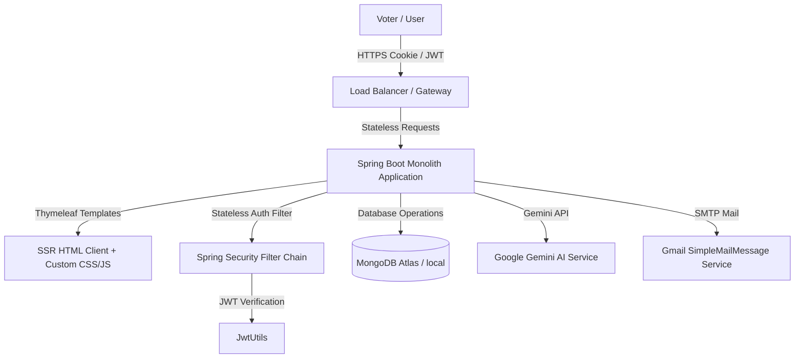

# VOTE INDIA - AI-Powered Secure Digital Voting Portal

VOTE INDIA is a state-of-the-art, secure, and AI-enhanced online voting platform built as a Spring Boot application using Thymeleaf, MongoDB, and the Google Gemini API.

---

## 🏛️ System Architecture



---

## 🚀 Key Features

1. **Decoupled Candidates to Elections**: Admin can specify exactly which candidates participate in each election. Voters only see options and scoreboard results for those assigned candidates.
2. **Stateless JWT Authentication**: Implements stateless HTTP-only cookie-based authentication with Access and Refresh tokens. Exposes `/health` public check and restricts browser back-button caching upon logout.
3. **SMTP OTP Verification**: Delivers email verification codes during registration and password resets using secure SMTP app passwords.
4. **AI-Powered Voter Assistant**: A context-aware chatbot using Google Gemini API to answer voting queries neutrally, handle conversation history, and summarize manifesto promises in multiple Indian regional scripts.
5. **Scoreboard & Visual Analytics**: Live Chart.js dashboards showing percentages and voting counts per candidate on closed elections.
6. **Dockerized Setup**: Production-optimized multi-stage Docker build and compose workflow.

---

## 🛠️ Tech Stack
- **Backend Framework**: Spring Boot 3.5.4
- **Database**: MongoDB (via Spring Data MongoDB)
- **Security**: Spring Security 6.x + JWT (`com.auth0:java-jwt`) + BCrypt
- **Templating**: Thymeleaf + Bootstrap 5.3.3
- **AI Model**: Google Gemini API (`gemini-1.5-flash`)
- **Containerization**: Docker & Docker Compose

---

## ⚙️ Environment Variables

| Variable Name | Description | Default / Example Value |
| --- | --- | --- |
| `PORT` | Container application port | `8081` |
| `MONGODB_URI` | Mongo Database Connection URI | `mongodb://mongodb:27017/votingdb` |
| `MAIL_USERNAME` | SMTP Email username | `your-email@gmail.com` |
| `MAIL_PASSWORD` | SMTP Email App Password | `xxxx xxxx xxxx xxxx` |
| `GEMINI_API_KEY` | Google Gemini developer API key | `AIzaSy...` |
| `APP_BASE_URL` | Application root URL for links | `http://localhost:8081` |

---

## 🐳 Running with Docker

Build and run both the database and the web application locally:

```bash
# Start all services in the background
docker-compose up -d --build

# View application logs
docker-compose logs -f app
```

Verify that the health check endpoint responds:
```bash
curl http://localhost:8081/health
# Output: {"status":"UP"}
```

---

## ☁️ Deployment Guidelines

### 1. MongoDB Database
- Setup a free tier cluster on **MongoDB Atlas**.
- Add the cluster connection string to your environment variables as `MONGODB_URI`.

### 2. Backend / Monolith
- Deploy to **Render** or **Heroku** by connecting your repository.
- Specify Build Command: `./mvnw clean package -DskipTests`
- Start Command: `java -jar target/votingsystem-0.0.1-SNAPSHOT.jar`
- Define the environment variables listed in the table above.
